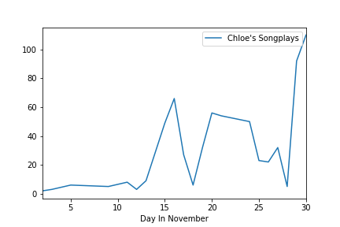
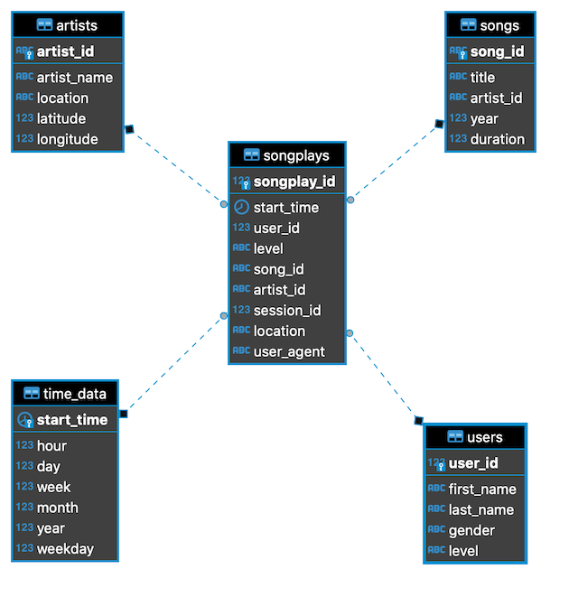

# Building a data model for Sparkify

### Project Description

The *Sparkify* startup has a bunch of JSON log files recording how people use their music streaming service, and they need a postgres database to be able to query and study this data. The task is to create a star schema that can logically hold data on users, which songs and artists people are listening to, and the times in which the app is being used. An ETL job is needed to extract the required values from a set of JSON files and load them into Postgres tables.

### How to run the project

The setup for this project is done by creating the database `sparkifydb` and associated tables with the file 'create_tables.py' followed by running 'etl.py' to parse the JSON files and insert the data. 

Both of these files are run in [*analysis.ipynb*](/notebooks/analysis.ipynb) by using `%run <file>`, and both pull the actual SQL queries from 'sql_queries.py'. 

[*analysis.ipynb*](/notebooks/analysis.ipynb) also contains some other analysis for the project, mainly producing graphs like this:

### Entity Relationship Diagram

This ERD was made with [DBeaver](https://dbeaver.io/).

In the star schema for this database, the fact table `songplays` holds the meat of the insight.  With this table, a data scientist/analyst can fetch the important data without writing complex queries. I used the `references` keyword in the create table statement for `songplays` to declare `user_id, song_id, artist_id` and `start_time` as foreign keys without handling conflicts. I thought this was best because in the case of a user updating their `level`, we would still want to know historically what that user was listening to before they upgraded/after they downgraded. Inserts into the users table, however, are set to update their level on conflict.

### Challenges

I used a serial primary key on the `songplays` table. The datatypes used in the other tables are pretty standard, however I did run into a problem trying to query the duration of a song. I ended up setting the duration column in `songs` to `numeric(8,5)` and set precision based on the maximum value I saw in the dataset. I set the longitude/latitude columns in `artists` to `decimal`, but since there are so many null values in the dataset, I didn't attempt any specific queries for those values.

The `time_data` table uses a `timestamp` type column for `start_time` as the primary key which is agnostic of time zone. I thought this was the simplest solution, and lends itself to modification later if necessary. Storing this data without time zone information may require a little bit of extra parsing during analysis, but in my mind is more flexible.

